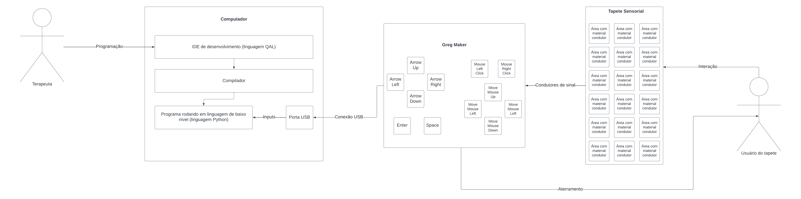

# Arquitetura do Sistema

## Diagrama da Arquitetura

## Descrição textual da Arquitetura

Na arquitetura apresentada, existem três dispositivos principais, os quais estão relacionados ao uso de dois usuários diferentes. No sistema, temos um **Computador**, utilizado pelo **Terapeuta** para configurar as funções do tapete e o sistema de recompensas, proporcionando uma maior personalização da experiência do paciente. Além disso, há um **Greg Maker**, responsável por captar os sinais elétricos provenientes do tapete interativo e interpretá-los, transformando-os em comandos específicos no computador. Por fim, temos um **Tapete Interativo**, utilizado pelo **Paciente** durante as atividades, com o objetivo de estimular a realização de tarefas específicas.

O tapete opera por meio de um material condutor localizado nos quadrantes delimitados na área do objeto, os quais detectam quando o paciente toca em determinada parte e enviam esse sinal para o Greg Maker. Este dispositivo recebe o sinal elétrico e o converte para o comando específico do quadrante acionado, permitindo assim que o paciente execute comandos no computador por meio do tapete.

Dentre os componentes de software, para garantir a funcionalidade completa do sistema, somente é necessário garantir o **acesso à aplicação web**. Serão usadas duas páginas na aplicação do sistema, uma para uso do terapeuta para configurar as funcionalidades do tapete por meio de um sistema de programação no-code, o qual serão utilizados blocos para definir as funções do programa, e outra para o uso durante as atividades, exibindo na tela informações importantes como as recompensas visuais pelas ações do paciente. Além disso, funcionando diretamente com a aplicação web, existe o compilador de código desenvolvido para facilitar a configuração do tapete, o qual transformará os diagramas construídos pelos terapeutas na plataforma de programação no-code em códigos propriamente ditos em Python.