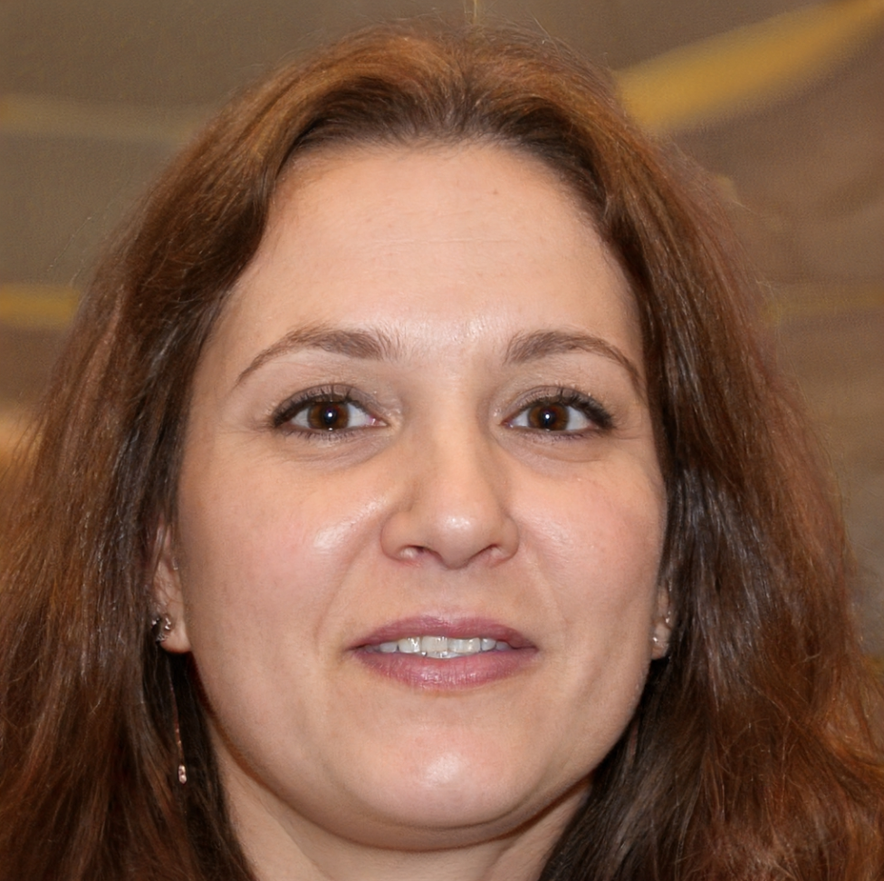
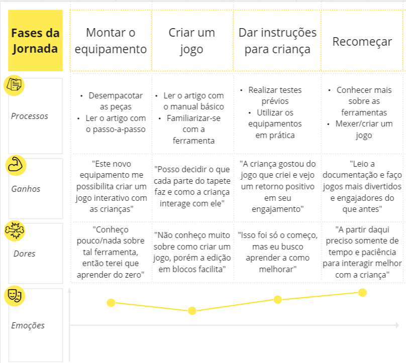

# Entendimento da Experiência do Usuário

## Personas
Para o projeto da AACD, foram criadas duas personas para o melhor entendimento dos usuários. A primeira persona é a criança que utiliza o tapete nas sessões, a segunda se trata da profissional que está atendendo a criança. 

### Persona 1

Nome: Lucas Teixeira Neves

Informações Demográficas: 5 anos, nasceu e cresceu em uma família humilde de São Mateus. Atualmente ele estuda em um colégio público de sua região chamado São João Evangelista.

Background: Lucas nasceu prematuro com 34 semanas. Com 1 ano a sua mãe percebeu que ele não conseguia andar. Após diversos exames, os médicos concluíram que ele possuía paralisia cerebral. Há 4 anos ele frequenta a AACD. 

Dores, necessidades e desejos: Lucas enfrenta desafios na expressão verbal, o que o motiva profundamente a buscar compreensão ao se comunicar.

Cenários de interação com o sistema: Durante suas consultas na clínica da AACD

Interesses e hábitos relacionados ao sistema ou produto: Lucas não tem acesso a dispositivos tecnológicos atualmente; em vez disso, terapeutas o auxiliam utilizando livros e brinquedos como ferramentas terapêuticas.

Nível de letramento digital: Baixa

### Persona 2

Nome: Marina Lopes Siqueira

Formação: Graduada em Psicologia com especialização em Terapia Ocupacional.

Informações Demográficas: 44 anos, nasceu em Campos Elíseos e se formou em terapia ocupacional na faculdade Cruzeiro do Sul.

Background: Marina é uma terapeuta ocupacional altamente qualificada, nascida em São Paulo e dedicada à sua profissão. Ela atualmente desempenha um papel crucial na AACD (Associação de Assistência à Criança Deficiente), onde coloca sua expertise em terapia ocupacional para melhorar a vida de pacientes com deficiências físicas e condições de saúde complexas. Sua abordagem personalizada e seu compromisso com o bem-estar de seus pacientes fazem dela uma profissional excepcional na área.

Dores, necessidades e desejos: Marina tem dificuldades de trabalhar por conta da baixa tecnologia dos itens utilizados nas consultas com as crianças 

Cenários de interação: Durante suas consultas na clínica da AACD

Interesses e hábitos relacionados ao sistema ou produto: Marina já teve contato com equipamentos de alta tecnologia em um evento recentemente. Porém, não possui um contato frequente com o sistema. 

Nível de letramento digital: Médio

## Mapa Jornada do Usuário

O Mapa da Jornada do Usuário é uma ferramenta importante para entender como o terapeuta e o paciente irão reagir ao uso do produto final. Nesta ferramenta são analisadas as etapas de aquisição, primeira experimentação e adaptação do(s) usuário(s) final(is), como as ações que o(s) usuários irão tomar, os ganhos atribuído a tais ações, possíveis dores que podem ser encontradas e qual são suas emoções naquele momento, positivas ou negativas.

Após discussões com professores da faculdade e com a própria Terapeuta Ocupacional Ana Carolina (Líder de Terapia Infantil do Projeto), foi decidido não incluir a Jornada do Usuário do Paciente, pois cada paciente reage de uma forma diferente ao a sessões de terapia e é altamente dependente do terapeuta atribuído a ele.

### Jornada do Terapeuta

O Terapeuta Ocupacional é quem toma as decisões de tratamentos e sessões a serem realizadas com o paciente. Por isso, saber quais são suas emoções e tomadas de decisão conforme se adapta ao produto é crucial para o time. Com estas informações, podemos mapear quais funcionalidades possuem prioridade na hora da implementação e como tornar a experiência do terapeuta simples e flexível para diferentes tipos de pacientes, com baixa complexidade e fácil usabilidade do sistema como um todo.

Toda jornada possui pontos que sumarizam cada fase, os escolhidos foram:

1. Processos: É mapeando quais são as possíveis decisões que podem ser tomadas naquela fase pelo usuário analisado.
2. Ganhos: Quais são os ganhos positivos que o produto traz ao usuário quanto os processos mapeados acima são realizados.
3. Dores: Quais são as dores/desgastes que são encontrados ao tomarem as decisões baseados nos processos citados acima.
4. Emoções: Um pequena gráfico que mostra onde se encontra a emoção do usuário em determinada fase. Este gráfico mostra se o usuário está feliz, neutro ou triste, e se há um declínio de emoções ou aumento gradativo delas.

A jornada proposta possui 4 fases:

1. Montar o Equipamento: A primeira parte consiste no terapeuta adquirindo o produto final. Neste pacote, há o tapete sensorial, Greg Maker e o compilador para criarem jogos adaptados aos pacientes. Conforme a Líder de Terapia Infantil do Projeto, os próprios terapeutas terão que montar o equipamento nas paredes, por isto esta parte está inclusa no mapa. Ao captarmos as reações dos terapeutas com o produto em mãos, podemos identificar certas dúvidas em como o equipamento funciona como um todo, e preocupações de como irão aprender as funcionalidades inclusas no produto para utilizarem nas sessões terapêuticas. Suas reações são mistas por causa do primeiro contato.
   
2. Criar um Jogo: Ao montarem o equipamento e iniciarem o programa com a linguagem desenvolvida pelo time, agora será necessário criar um jogo que gere engajamento as crianças. Mesmo a linguagem sendo no code, não é fácil aprender a utilizar uma nova ferramenta, levando em consideração do fato que poucos dos terapeutas possuem familiaridade com conceitos universais de lógica de programação. Esta etapa é especialmente delicada pois não se pode criar um jogo sem levar em consideração as necessidades únicas de cada indivíduo que o jogo será criado. Por exemplo, um som muito alto poderá desorientar e perturbar pacientes com autismo. As emoções não são tão positivas nesta fase.
3. Dar Instruções para a Criança: Após a criação e teste do jogo, o terapeuta introduz o jogo para a criança em uma sessão e analisa se o feedback será positivo ou negativo. Espera-se que com esforço e paciência na tomada de decisões e leitura dos manuais que estavam inclusos no pacote citado acima, o terapeuta presenciará um retorno positivo do paciente, e poderá adquirir informações importantes para o tratamento, como tempo de resposta entre ações e quantas tentativas houve até apertar um certo botão, por exemplo. As emoções são moderadamente positivas com espaço para melhora.
4. Recomeçar: A partir desta fase, o terapeuta reconhece as funcionalidades do produto e visa estudar mais e testar novos jogos para os pacientes. Conforme mais sessões são realizadas com um determinado paciente, ele coletará dados sobre as sessões e poderá mostrar tais informações para os responsáveis de tal paciente, com o objetivo de diagnosticarem se houve uma melhora ou piora de comportamento. As emoções dos terapeutas se mostram altas e positivas, e o terapeuta avalia que a ferramenta satisfaz necessidades de instrução com as crianças que antes se mostravam difíceis ou inviáveis, tanto por causa dos jogos utilizados serem de uso comercial e de entretenimento, tanto por não serem adaptados para os pacientes.

## User Story

User story é uma técnica utilizada no desenvolvimento ágil de software para descrever uma funcionalidade do ponto de vista do usuário, geralmente em um formato simples, como "Como [tipo de usuário], eu quero [realizar uma ação] para [atingir um objetivo]." Essas histórias capturam requisitos de forma clara e concisa, focando nas necessidades do usuário, o que facilita a comunicação entre os membros da equipe e ajuda a manter o cliente no centro do processo de desenvolvimento. A importância das user stories reside na sua capacidade de fornecer um entendimento compartilhado das funcionalidades desejadas, promovendo a priorização adequada, permitindo entregas incrementais e melhorando a flexibilidade para acomodar mudanças ao longo do projeto, resultando em produtos que melhor atendem às necessidades reais dos usuários.

| Épico    | Prioridade | Complexidade (Fibonacci)| User Story | Status   |
| -------- |:--------:  | :-------------------:| -----------| :--------: |
| Usabilidade |     10     | 1                    | Como terapeuta ocupacional, gostaria de poder conectar meu tapete sensorial ao Greg Maker para personalizar a experiência sensorial com luzes e sons, proporcionando uma estimulação sensorial sob medida. | Em desenvolvimento |
| Cadastro |     9      | 1                    | Como terapeuta ocupacional, desejo criar configurações específicas no Greg Maker para se alinharem com os objetivos terapêuticos do paciente, como promover a concentração, relaxamento ou desenvolver habilidades motoras. | Em desenvolvimento |
| Usabilidade | 10      | 13                   | Como terapeuta ocupacional, gostaria de ter a capacidade de programar o Greg Maker para oferecer uma experiência sensorial que seja segura, envolvente e apropriada para o desenvolvimento infantil. | Em desenvolvimento |
| Programação | 10      | 13                   | Como terapeuta ocupacional, gostaria de usar o Greg Maker para controlar a intensidade e a duração da estimulação sensorial no tapete, para que eu possa adaptar a experiência às minhas necessidades e preferências específicas. | Em desenvolvimento |
| Programação | 10      | 8                    | Como terapeuta ocupacional, desejo uma integração fácil entre o tapete sensorial e o Greg Maker, a fim de criar ambientes de aprendizagem mais envolventes e inclusivos para todos os alunos, independentemente de suas habilidades.| Em desenvolvimento |
| Terapia | 10          | 2                    | Como terapeuta ocupacional, desejo a capacidade de sincronizar as atividades de linguagem e comunicação com estímulos sensoriais gerados pelo Greg Maker, criando uma experiência terapêutica mais envolvente.  | Em desenvolvimento |
| Terapia | 10          | 21                   | Como criança com mobilidade reduzida, gostaria de uma interface acessível no Greg Maker que me permita controlar o tapete sensorial de forma independente, mesmo que eu tenha limitações de destreza. | Em desenvolvimento |
| Programação | 9        | 21                   | Como desenvolvedor do projeto, desejo a capacidade de criar aplicativos complementares para o Greg Maker que ampliem suas funcionalidades, proporcionando uma experiência sensorial ainda mais personalizada.| Em desenvolvimento |
| Terapia | 10          | 21                   | Como criança com mobilidade reduzida, gostaria de poder compartilhar minha experiência com o Greg Maker e o tapete sensorial com outras crianças em situações semelhantes, promovendo a comunidade e o apoio mútuo.| Em desenvolvimento |